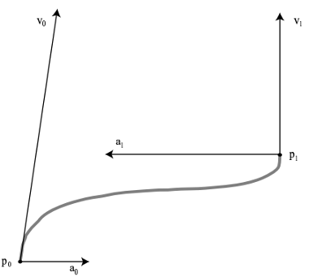

# Path Planning and Following

<!-- TOC depthFrom:2 depthTo:6 updateOnSave:true withLinks:true -->

- [Introduction](#introduction)
- [From Waypoints to Motor Voltages](#from-waypoints-to-motor-voltages)
    - [A Smooth Path](#a-smooth-path)
    - [A Fast Path](#a-fast-path)
    - [An Accurate Path](#an-accurate-path)
- [The Rubber Hits the Road](#the-rubber-hits-the-road)
    - [DriveMotionPlanner.java](#drivemotionplannerjava)
    - [TrajectoryGenerator.java](#trajectorygeneratorjava)
    - [Trajectory.java](#trajectoryjava)
    - [QuinticHermiteSpline.java](#quintichermitesplinejava)
- [References](#references)
    - [splines](#splines)

<!-- /TOC -->


## Introduction

Path-following has been an advanced capability for FRC teams. This is because
the time investment required to obtain accurate results is quite high.  Here
are some of the commitments required to master path following:

* Trajectory authoring
* Robot state estimation and odometry
* Closed-loop trajectory following controller
* [Drivetrain characterization](DriveCharacterization.md)
* PID tuning
    * for path following controller
    * for motor controller

With the advent of [Jaci's Pathfinder](https://github.com/JacisNonsense/Pathfinder)
and [Team 254's DriveMotionPlanner](https://github.com/Team254/FRC-2018-Public/blob/master/src/main/java/com/team254/frc2018/planners/DriveMotionPlanner.java),
the cost of entry has been significantly reduced and it has become relatively
common for mid and top tier teams to deploy some variant of this technology.

We adopted Team254's codebase primarily due to the leg-up it gave us in
obtaining this capability.  Herein we'll go into the theory and operation
of their path-follower implementation.

## From Waypoints to Motor Voltages

The idea behind a path follower is actually quite simple.  In order to
describe the trajectory of a robot, we need to describe a sequence of
places, or _waypoints_, on the field that we'd like our robot to visit.
If timing isn't a concern, we can easily imagine an implementation:

1. orient robot in the direction of the next waypoint
2. travel accurately the distance to the next waypoint
3. if not at final waypoint: goto 1
4. stop

The key problems with this approach are its lack of speed and "grace".
Breaking the path into linear segments (a-la connect-the-dots) would:

* be slow because:
    * we need to converge upon two distinct setpoints for each waypoint (distance then angle)
    * we stop and start at each waypoint
* lack grace because:
    * wouldn't cut corners, only straight, then turn, then straight

To resolve these issues we need to solve these problems:

1. figure out how smooth our connect-the-dots approach
2. optimize timing _along the path_ so that we minimize the run time while
   enforcing physical constaints to ensure repeatability
3. figure out how to measure our path-following error so we can implement
   a feedback control solution.

### A Smooth Path

Recall from [Odometry](Odometry.md) that we represent the static robot state
via its field position _and_ orientation, aka its _pose_ (represented via `Pose2d`).
The common technique to produce a smooth curvy path through a set of poses is
to "fit" a higher order polynomial that obeys the set of position and
orientation constraints that characterize our robot path. For a path with N
waypoints, we would require a polynomial of degree N-1 to ensure that we
actually reach all the target locations.  A higher-order polynomial might
be required to resolve additional contraints (like minimum turning radius).
Because high-order polynomials are unwieldy it's much more common to think
of a path as a seriies of lower-order polynomial path segments and most
computer-literate people encounter these in drawing, drafting and painting
software packages. The idea of describing a path with a series of
of smoothed segments is called a [spline](https://en.wikipedia.org/wiki/Spline_(mathematics))
named after a [tool](https://en.wikipedia.org/wiki/File:Spline_(PSF).png)
traditionally used in boat hull design and construction.

Mathematical splines come in a number of flavors characterized primarily by
their _order_ and their constraints.  If you want the simplest path that
intersects a set of waypoints, you might choose a [cubic Catmull-Rom spline](https://en.wikipedia.org/wiki/Centripetal_Catmull%E2%80%93Rom_spline).
All cubic splines reduce to a cubic polynomial, `A*s^3 + B*s^2 + C*s + D`,
where s is a parameter that varies from 0 representing the beginning
of the segment to 1 representing its end.  Different spline flavors specify
how to compute A, B, C, and D based on the Cartesian coordinates of the path.
Keen observers will notice that our path has 3 numbers (x, y, theta) at
each waypoint and thus we really require 3 sets of A,B,C,D and therefore three
polynomials.  Keener observers might notice that theta is a _derived_
term for a moving robot.  In other words, the value of theta is implied
by our trajectory:  it is the _tangent_ to the curve. So we really
have two splines and thus two polynomials.

As we'll soon understand, we may need to impose additional constraints on
our curve to accomodate the laws of physics and the specifics of our robot
as discussed [here](DriveTrainCharacterization.md).  For example, we may
need finer control over the maximum curvature of paths generated by our
spline.  For this reason a higher order polynomial is in order.  For those
familiar with calculus and physics, if we want to guarantee smoothness
of, say velocity (2nd derivative of position) between spline segments,
we need a cubic polymial.  But if we want to guarantee smoothness for
acceleration we need a 5th order polynomial. In robotics the choice of
a _quintic polynomial_ is common because we want smooth acceleration
([aka jerk](https://en.wikipedia.org/wiki/Jerk_(physics))).
A convenient form to express our contraints is the
[quintic hermite spline](https://www.rose-hulman.edu/~finn/CCLI/Notes/day09.pdf)
 becauses its control points are exactly these physical derivatives at
 each way point.

   

In this diagram the six constraints on our curve include beginning and
ending position (p0,p1), velocity (v0, v1) and acceleration (a0, a1).
Referring to our code, the Pose2d specifies position and orientation.
In our diagram, we can produce values for (v0, v1) by scaling the
robot orientation vector by the _tangential speed_ for our robot.
The values for v0 indicate that the speed in y is greater than the
speed in x. This is why the robot is pointing that way at the begining
of the segment. The value for a0 indicates that the velocity is changing
primarily in x and this is what accounts for the dramatic right turn.
It must be noted that there are values for (a0,a1) that produce invalid
results for our spline.  Specifically imagine if we set them to (0,0).
Without acceleration, we can't turn and so the curve could never start
at p0,v0 and end at p1,v1.  On the other hand if we set v0 to (p1-p0)
and v1 to v0, then an acceleration of (0,0) could produce a valid curve.
To develop a better intuition of how the values interact, check out
this [online spline editor](https://www.desmos.com/calculator/v8hozhn35m).

Recall that a path is a collection of hermite cubic segments, we see now
how we can enforce physical properties across spline segments: we simply make
sure that neighboring segments share the same values as their neighboring
end-points. So, while we haven't yet discussed how to select velocities
and accelerations along on our spline, we now understand what to do with
them once we have them.

In order for our robot to follow the spline, we must _evaluate it_ at
intervals along its length.  To produce sequential values along the
spline we can sequentially iterate over its segments like this:

```java
double pos[3], vel[3], acc[3];
double A[3], B[3], C[3], D[3], E[3], F[3];
double deltaA = .1;
for(int i=0;i<numSegments;i++)
{
    Segment segment = segments[i];
    segment.getParameters(A, B, C, D, E, F);
    for(double s=0.0; s <= 1.0; s+=deltaS)
    {
        for(int j = 0; j < 3, j++)
        {
            pos[j] = splineEval(s, A[j], B[j], C[j], D[j], E[j], F[j]);
            vel[j] = splineEvalDeriv(s, A[j], B[j], C[j], D[j], E[j], F[j]);
            acc[j] = splineEvalDeriv2(s, A[j], B[j], C[j], D[j], E[j], F[j]);
        }
        // now do something with pos, vel, acc
    }
}
```

Because we have a quintic polynomial, its 1st and 2nd derivatives are
well-defined and implied by a subset of the provided coefficients.

One subtlety that we'll gloss over for now:  how do with pick `deltaS` and
what is the interpretation of this value?  For now we can think of it
as dividing a given segment into equal chunks, perhaps even time intervals.
Something to ponder: what is the relationship between this value and
the velocity?

### A Fast Path

### An Accurate Path

## The Rubber Hits the Road

### DriveMotionPlanner.java

``` java
TrajectoryIterator<TimedState<Pose2dWithCurvature>> mCurrentTrajectory;
mCurrentTrajectory = TrajectoryGenerator.generate("a named trajectory");
```

### TrajectoryGenerator.java

```java
class Pose2dWithCurvature
{
    // Pose2d
    Translation2d xlate;
    Rotation2d rotate;
    // with curvature
    double curvature_;
    double dcurvature_ds_;
}
```

### Trajectory.java


### QuinticHermiteSpline.java


# See Also

[Ramesete Nonlinear Controller (section 12.1 of state-space-guide)](https://github.com/calcmogul/state-space-guide/blob/master/modern-control-theory/nonlinear-control/control-law-for-nonholonomic-wheeled-vehicle.tex)

[254 2018 reveal thread](
https://www.chiefdelphi.com/t/team-254-presents-lockdown-technical-binder-2018/166515/69)

```text
The optimization function is simple iterated gradient descent 1. At
iteration N+1, we compute the partial derivatives on rate of change
of curvature w.r.t. arc length for the curve at iteration N, then
take a step in the direction that minimizes the magnitude of the
derivative. Keep iterating until you hit a termination condition (max
number of iterations, or the improvement between the last two iterations
is too small).

For following, we did not use pure pursuit except at our first event. After AZ North we finished our nonlinear feedback controller 3 and used that going forward. This controller generates velocity setpoints based on the current pose of the robot and feedforward velocity and acceleration terms from our trajectory.

Our feedforward generation techniques used a dynamic model 2 of a skid-steer drivetrain to generate voltage setpoints that account for torques due to chassis linear acceleration, chassis angular acceleration, and a variety of friction effects.
```

## References

### splines
* [cmu lecture slide on splines](http://www.cs.cmu.edu/afs/cs/academic/class/15462-s10/www/lec-slides/lec06.pdf)
* [rose-hulman quintic hermite notes](https://www.rose-hulman.edu/~finn/CCLI/Notes/day09.pdf)
* [online cubic hermite editor](https://www.desmos.com/calculator/v8hozhn35m)